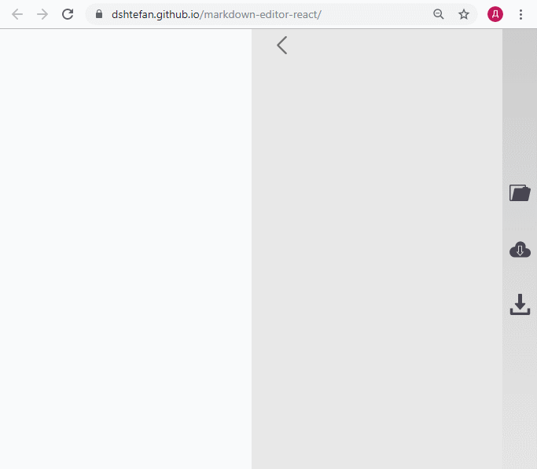
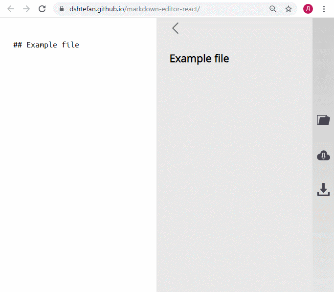
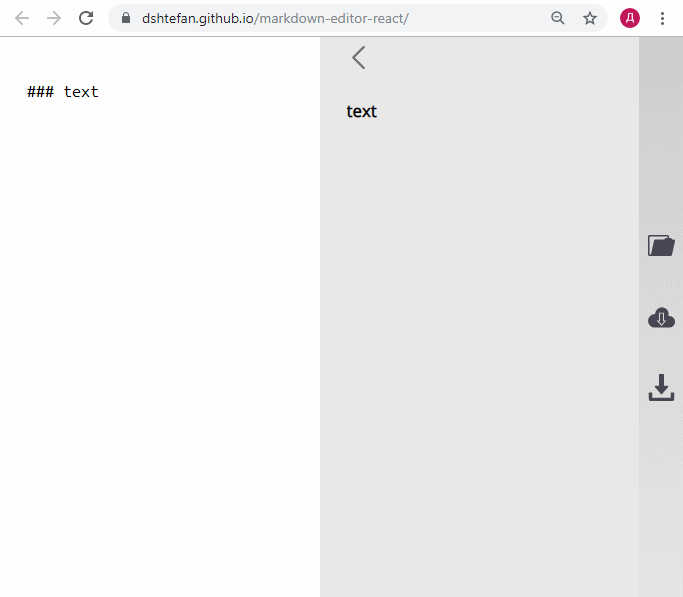
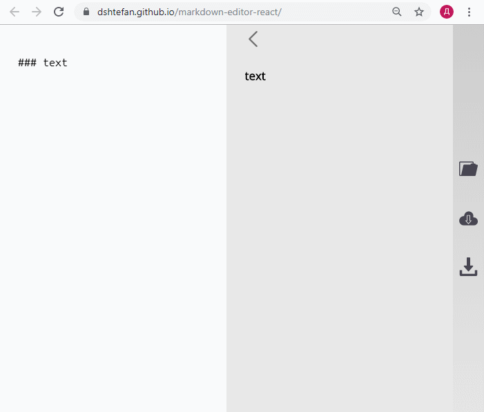

# markdown-editor-react

Редактор markdown разметки.

## Демо

Чтобы посмотреть на него в действии, перейди по [этой ссылке](https://dshtefan.github.io/markdown-editor-react/).

## Используемый стек

- React
- Webpack + Babel
- CSS Grid + Flexbox
- markedjs

## Доп. функционал

- Открытие локального файла

  
   
- Сохранение текста в local storage браузера

  

- Скачивание файла

  
  
- Также есть немного анимации :)

  
